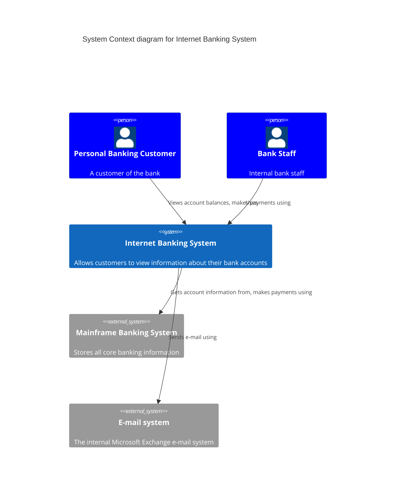
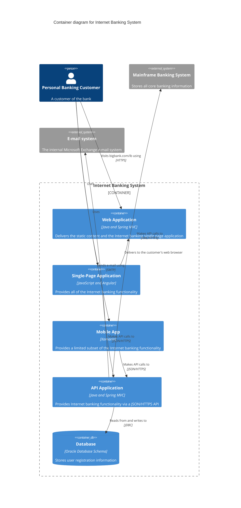
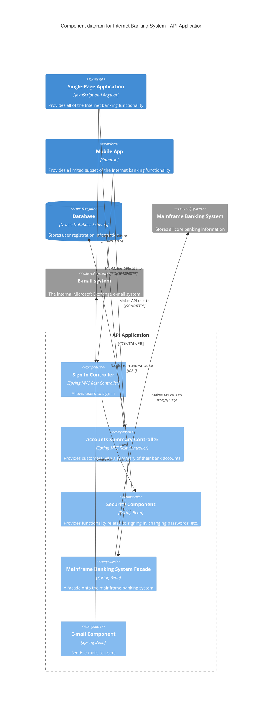
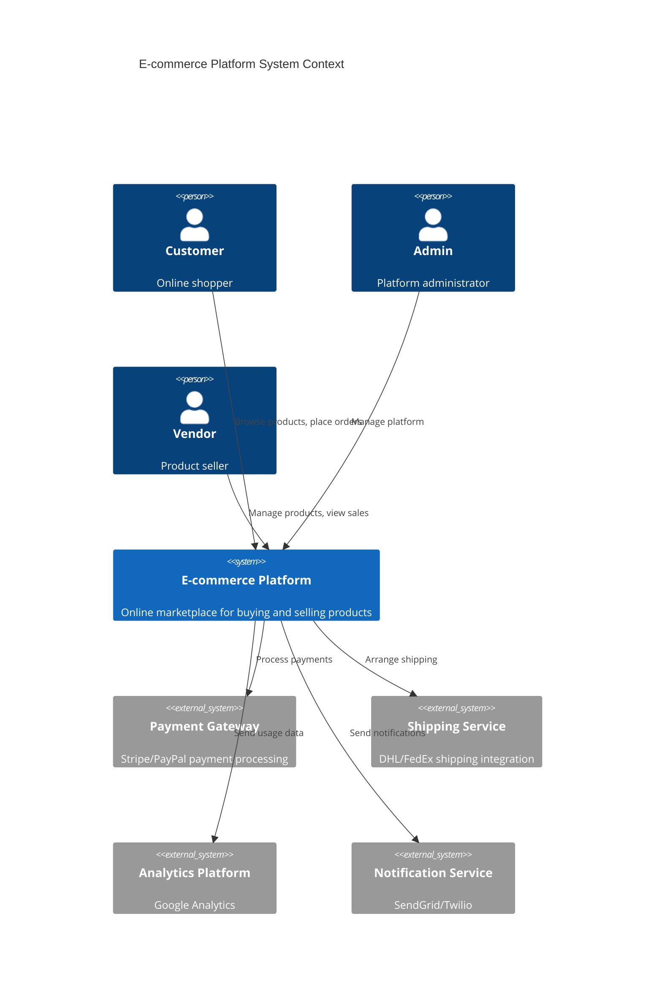
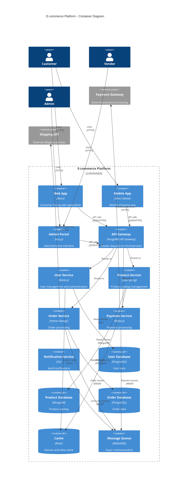

# C4 Model 架構圖實作範例

## 1. System Context (系統上下文圖)

### Mermaid 版本


### PlantUML 版本
```plantuml
@startuml
!include https://raw.githubusercontent.com/plantuml-stdlib/C4-PlantUML/master/C4_Context.puml

title System Context diagram for Internet Banking System

Person(customer, "Personal Banking Customer", "A customer of the bank")
Person(staff, "Bank Staff", "Internal bank staff")

System(internetBanking, "Internet Banking System", "Allows customers to view information about their bank accounts")
System_Ext(mainframe, "Mainframe Banking System", "Stores all core banking information")
System_Ext(email, "E-mail system", "The internal Microsoft Exchange e-mail system")

Rel(customer, internetBanking, "Views account balances, makes payments using")
Rel(staff, internetBanking, "Uses")
Rel(internetBanking, mainframe, "Gets account information from, makes payments using")
Rel(internetBanking, email, "Sends e-mail using")

@enduml
```

## 2. Container Diagram (容器圖)

### Mermaid 版本


### PlantUML 版本
```plantuml
@startuml
!include https://raw.githubusercontent.com/plantuml-stdlib/C4-PlantUML/master/C4_Container.puml

title Container diagram for Internet Banking System

Person(customer, "Personal Banking Customer", "A customer of the bank")

System_Boundary(c1, "Internet Banking System") {
    Container(webApp, "Web Application", "Java and Spring MVC", "Delivers the static content and the Internet banking single page application")
    Container(spa, "Single-Page Application", "JavaScript and Angular", "Provides all of the Internet banking functionality")
    Container(mobileApp, "Mobile App", "Xamarin", "Provides a limited subset of the Internet banking functionality")
    Container(apiApp, "API Application", "Java and Spring MVC", "Provides Internet banking functionality via a JSON/HTTPS API")
    ContainerDb(database, "Database", "Oracle Database Schema", "Stores user registration information")
}

System_Ext(mainframe, "Mainframe Banking System", "Stores all core banking information")
System_Ext(email, "E-mail system", "The internal Microsoft Exchange e-mail system")

Rel(customer, webApp, "Visits bigbank.com/ib using", "HTTPS")
Rel(customer, spa, "Uses")
Rel(customer, mobileApp, "Uses")

Rel_Back(webApp, spa, "Delivers to the customer's web browser")
Rel(spa, apiApp, "Makes API calls to", "JSON/HTTPS")
Rel(mobileApp, apiApp, "Makes API calls to", "JSON/HTTPS")
Rel(apiApp, database, "Reads from and writes to", "JDBC")
Rel(apiApp, mainframe, "Makes API calls to", "XML/HTTPS")
Rel(apiApp, email, "Sends e-mail using", "SMTP")

@enduml
```

## 3. Component Diagram (元件圖)

### Mermaid 版本


### PlantUML 版本
```plantuml
@startuml
!include https://raw.githubusercontent.com/plantuml-stdlib/C4-PlantUML/master/C4_Component.puml

title Component diagram for Internet Banking System - API Application

Container(spa, "Single-Page Application", "JavaScript and Angular", "Provides all of the Internet banking functionality")
Container(ma, "Mobile App", "Xamarin", "Provides a limited subset of the Internet banking functionality")
ContainerDb(db, "Database", "Oracle Database Schema", "Stores user registration information")

Container_Boundary(api, "API Application") {
    Component(sign, "Sign In Controller", "Spring MVC Rest Controller", "Allows users to sign in")
    Component(accounts, "Accounts Summary Controller", "Spring MVC Rest Controller", "Provides customers with a summary of their bank accounts")
    Component(security, "Security Component", "Spring Bean", "Provides functionality related to signing in, changing passwords, etc.")
    Component(mbsfacade, "Mainframe Banking System Facade", "Spring Bean", "A facade onto the mainframe banking system")
    Component(email, "E-mail Component", "Spring Bean", "Sends e-mails to users")
}

System_Ext(mbs, "Mainframe Banking System", "Stores all core banking information")
System_Ext(es, "E-mail system", "The internal Microsoft Exchange e-mail system")

Rel(spa, sign, "Makes API calls to", "JSON/HTTPS")
Rel(spa, accounts, "Makes API calls to", "JSON/HTTPS")
Rel(ma, sign, "Makes API calls to", "JSON/HTTPS")
Rel(ma, accounts, "Makes API calls to", "JSON/HTTPS")

Rel(sign, security, "Uses")
Rel(accounts, mbsfacade, "Uses")
Rel(security, db, "Reads from and writes to", "JDBC")
Rel(mbsfacade, mbs, "Makes API calls to", "XML/HTTPS")
Rel(email, es, "Sends e-mail using")

@enduml
```

## 4. 現代化微服務架構範例

### 微服務 System Context (Mermaid)


### 微服務 Container Diagram (Mermaid)


## 5. 部署架構圖範例 (Kubernetes)

### PlantUML 部署圖
```plantuml
@startuml
!include https://raw.githubusercontent.com/plantuml-stdlib/C4-PlantUML/master/C4_Deployment.puml

title E-commerce Platform - Deployment Diagram (AWS EKS)

Deployment_Node(aws, "AWS Cloud", "Amazon Web Services") {
    Deployment_Node(vpc, "VPC", "Virtual Private Cloud") {
        Deployment_Node(public_subnet, "Public Subnet", "10.0.1.0/24") {
            Deployment_Node(alb, "Application Load Balancer", "AWS ALB") {
                Container(load_balancer, "Load Balancer", "ALB", "Routes traffic to EKS")
            }
            Deployment_Node(nat, "NAT Gateway", "AWS NAT Gateway") {
                Container(nat_gw, "NAT Gateway", "NAT", "Outbound internet access")
            }
        }
        
        Deployment_Node(private_subnet, "Private Subnet", "10.0.2.0/24") {
            Deployment_Node(eks, "EKS Cluster", "Kubernetes 1.24") {
                Deployment_Node(node_group, "Node Group", "EC2 Instances") {
                    Container(api_gateway, "API Gateway", "Kong", "API routing and rate limiting")
                    Container(user_service, "User Service", "Node.js Pod", "User management")
                    Container(product_service, "Product Service", "Java Pod", "Product catalog")
                    Container(order_service, "Order Service", "Python Pod", "Order processing")
                }
            }
            
            Deployment_Node(rds, "RDS Subnet Group", "Database subnet") {
                ContainerDb(postgres, "PostgreSQL", "RDS PostgreSQL", "Relational data")
                ContainerDb(redis, "Redis", "ElastiCache", "Cache layer")
            }
        }
    }
}

Deployment_Node(external, "External Services") {
    System_Ext(stripe, "Stripe", "Payment processing")
    System_Ext(sendgrid, "SendGrid", "Email notifications")
}

Person(user, "End User", "Application user")

Rel(user, load_balancer, "HTTPS requests")
Rel(load_balancer, api_gateway, "Routes to")
Rel(api_gateway, user_service, "Service calls")
Rel(api_gateway, product_service, "Service calls")
Rel(api_gateway, order_service, "Service calls")

Rel(user_service, postgres, "Database queries")
Rel(product_service, redis, "Cache access")
Rel(order_service, postgres, "Database queries")

Rel(order_service, stripe, "Payment API")
Rel(user_service, sendgrid, "Email API")

@enduml
```

## 實務建議

### Mermaid vs PlantUML 比較

**Mermaid 優勢：**
- GitHub/GitLab 原生支援，無需額外設定
- 語法相對簡潔
- VS Code 外掛支援良好
- 適合快速原型和簡單圖表

**PlantUML 優勢：**
- C4 Model 支援更完整 (官方 C4-PlantUML 函式庫)
- 客製化選項更豐富
- 複雜圖表處理能力更強
- 企業級功能更完善

### 建議的工具選擇策略

1. **新專案或簡單架構**：使用 Mermaid
2. **複雜企業架構**：使用 PlantUML + C4-PlantUML
3. **混合使用**：不同層級使用不同工具

### 檔案組織建議

```
docs/
├── architecture/
│   ├── c4-context.md          # 系統上下文圖
│   ├── c4-container.md        # 容器圖  
│   ├── c4-component-api.md    # API 元件圖
│   ├── c4-component-web.md    # Web 元件圖
│   └── deployment.md          # 部署圖
├── adr/                       # Architecture Decision Records
└── runbooks/                  # 運維手冊
```

這樣可以讓架構文件與程式碼一起進行版本控制，確保文件的時效性和可追蹤性。