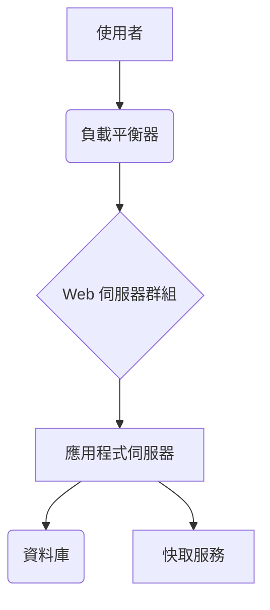

# 1. 系統總覽 (System Overview)

## 1.1 簡介

[簡要描述系統的目的、主要功能以及其在整體業務中的角色。]

## 1.2 架構圖

[嵌入或連結到系統的高層次架構圖。例如，C4 Model 的 Context 圖或 Container 圖。]

## 1.3 關鍵組件

*   **組件 A**: [描述其功能與技術堆疊]
*   **組件 B**: [描述其功能與技術堆疊]
*   **資料庫**: [使用的資料庫類型及其用途]

## 1.4 服務依賴關係

*   **上游依賴**:
    *   [依賴的服務 1]: [用途]
    *   [依賴的服務 2]: [用途]
*   **下游依賴**:
    *   [被此服務依賴的服務 1]: [用途]

## 1.5 關鍵業務流程

1.  **流程一 (例如：使用者註冊)**: [簡述流程步驟]
2.  **流程二 (例如：訂單處理)**: [簡述流程步驟] 