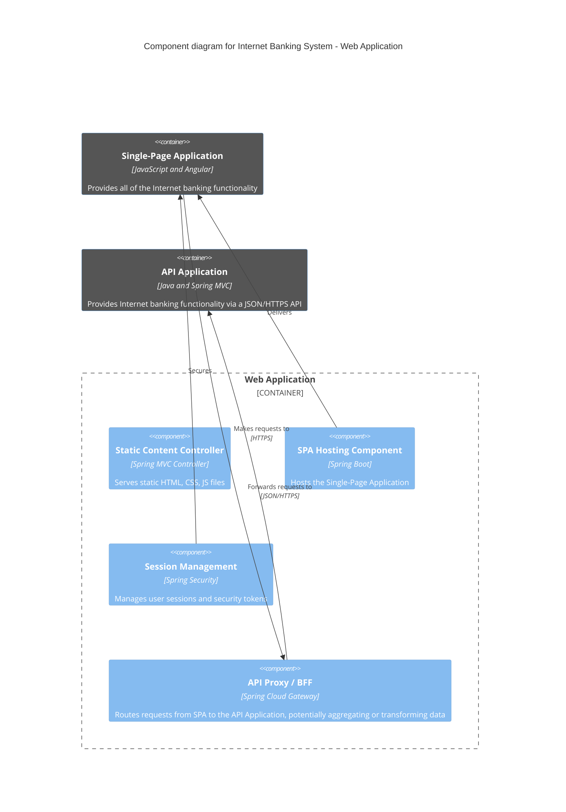

# Web Component Diagram

```mermaid
C4Component
    title Component diagram for Internet Banking System - Web Application

    Container(spa, "Single-Page Application", "JavaScript and Angular", "Provides all of the Internet banking functionality")
    Container(apiApp, "API Application", "Java and Spring MVC", "Provides Internet banking functionality via a JSON/HTTPS API")

    Container_Boundary(web, "Web Application") {
        Component(staticContentCtrl, "Static Content Controller", "Spring MVC Controller", "Serves static HTML, CSS, JS files")
        Component(spaHost, "SPA Hosting Component", "Spring Boot", "Hosts the Single-Page Application")
        Component(sessionMgmt, "Session Management", "Spring Security", "Manages user sessions and security tokens")
        Component(apiProxy, "API Proxy / BFF", "Spring Cloud Gateway", "Routes requests from SPA to the API Application, potentially aggregating or transforming data")
    }

    Rel(spaHost, spa, "Delivers")
    Rel(sessionMgmt, spa, "Secures")
    Rel(spa, apiProxy, "Makes requests to", "HTTPS")
    Rel(apiProxy, apiApp, "Forwards requests to", "JSON/HTTPS")

    UpdateElementStyle(spa, $fontColor="white", $bgColor="#555555")
    UpdateElementStyle(apiApp, $fontColor="white", $bgColor="#555555")
``` 