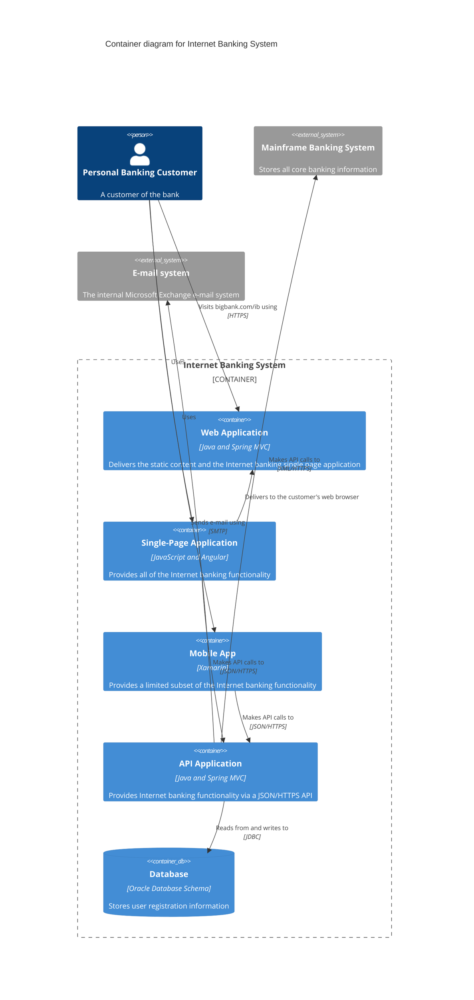

# Container Diagram

```mermaid
C4Container
    title Container diagram for Internet Banking System
    
    Person(customer, "Personal Banking Customer", "A customer of the bank")
    
    Container_Boundary(c1, "Internet Banking System") {
        Container(webApp, "Web Application", "Java and Spring MVC", "Delivers the static content and the Internet banking single page application")
        Container(spa, "Single-Page Application", "JavaScript and Angular", "Provides all of the Internet banking functionality")
        Container(mobileApp, "Mobile App", "Xamarin", "Provides a limited subset of the Internet banking functionality")
        Container(apiApp, "API Application", "Java and Spring MVC", "Provides Internet banking functionality via a JSON/HTTPS API")
        ContainerDb(database, "Database", "Oracle Database Schema", "Stores user registration information")
    }
    
    System_Ext(mainframe, "Mainframe Banking System", "Stores all core banking information")
    System_Ext(email, "E-mail system", "The internal Microsoft Exchange e-mail system")
    
    Rel(customer, webApp, "Visits bigbank.com/ib using", "HTTPS")
    Rel(customer, spa, "Uses")
    Rel(customer, mobileApp, "Uses")
    
    Rel_Back(webApp, spa, "Delivers to the customer's web browser")
    Rel(spa, apiApp, "Makes API calls to", "JSON/HTTPS")
    Rel(mobileApp, apiApp, "Makes API calls to", "JSON/HTTPS")
    Rel(apiApp, database, "Reads from and writes to", "JDBC")
    Rel(apiApp, mainframe, "Makes API calls to", "XML/HTTPS")
    Rel(apiApp, email, "Sends e-mail using", "SMTP")
``` 