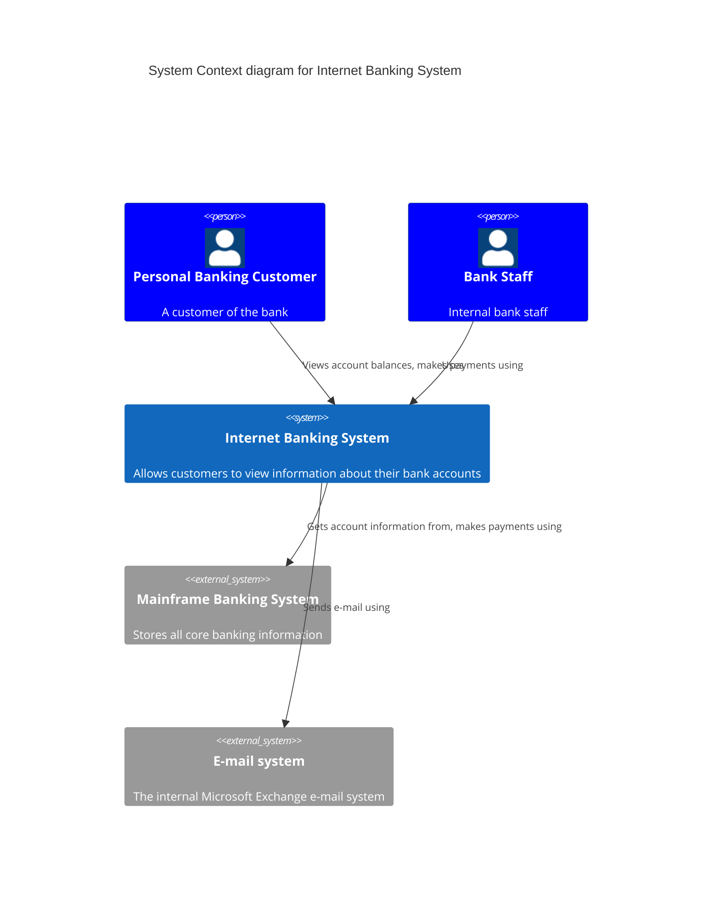

# System Context Diagram

```mermaid
C4Context
    title System Context diagram for Internet Banking System
    
    Person(customer, "Personal Banking Customer", "A customer of the bank")
    Person(staff, "Bank Staff", "Internal bank staff")
    
    System(internetBanking, "Internet Banking System", "Allows customers to view information about their bank accounts")
    System_Ext(mainframe, "Mainframe Banking System", "Stores all core banking information")
    System_Ext(email, "E-mail system", "The internal Microsoft Exchange e-mail system")
    
    Rel(customer, internetBanking, "Views account balances, makes payments using")
    Rel(staff, internetBanking, "Uses")
    Rel(internetBanking, mainframe, "Gets account information from, makes payments using")
    Rel(internetBanking, email, "Sends e-mail using")
    
    UpdateElementStyle(customer, $fontColor="white", $bgColor="blue")
    UpdateElementStyle(staff, $fontColor="white", $bgColor="blue")
``` 