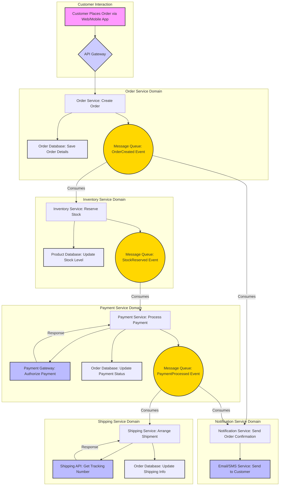

# Data Flow Diagram

## Example: E-commerce Order Processing Data Flow

```mermaid
graph TD
    subgraph Customer Interaction
        A[Customer Places Order via Web/Mobile App] --> B{API Gateway};
    end

    subgraph Order Service Domain
        B --> C[Order Service: Create Order];
        C --> D[Order Database: Save Order Details];
        C --> E((Message Queue: OrderCreated Event));
    end

    subgraph Inventory Service Domain
        E -- Consumes --> F[Inventory Service: Reserve Stock];
        F --> G[Product Database: Update Stock Level];
        F --> H((Message Queue: StockReserved Event));
    end

    subgraph Payment Service Domain
        H -- Consumes --> I[Payment Service: Process Payment];
        I --> J[Payment Gateway: Authorize Payment];
        J -- Response --> I;
        I --> K[Order Database: Update Payment Status];
        I --> L((Message Queue: PaymentProcessed Event));
    end

    subgraph Notification Service Domain
        E -- Consumes --> M[Notification Service: Send Order Confirmation];
        L -- Consumes --> M;
        M --> N[Email/SMS Service: Send to Customer];
    end

    subgraph Shipping Service Domain
        L -- Consumes --> O[Shipping Service: Arrange Shipment];
        O --> P[Shipping API: Get Tracking Number];
        P -- Response --> O;
        O --> Q[Order Database: Update Shipping Info];
    end

    style A fill:#f9f,stroke:#333,stroke-width:2px
    style B fill:#ccf,stroke:#333,stroke-width:2px
    style D fill:#lightgrey,stroke:#333,stroke-width:2px
    style G fill:#lightgrey,stroke:#333,stroke-width:2px
    style K fill:#lightgrey,stroke:#333,stroke-width:2px
    style Q fill:#lightgrey,stroke:#333,stroke-width:2px
    style J fill:#bbf,stroke:#333,stroke-width:2px
    style N fill:#bbf,stroke:#333,stroke-width:2px
    style P fill:#bbf,stroke:#333,stroke-width:2px
    style E fill:#FFD700,stroke:#333,stroke-width:2px
    style H fill:#FFD700,stroke:#333,stroke-width:2px
    style L fill:#FFD700,stroke:#333,stroke-width:2px
``` 